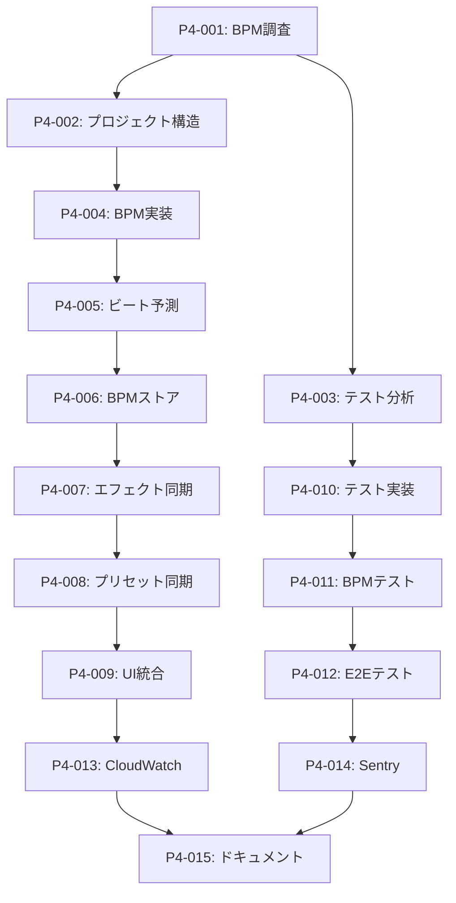

# 🎯 実行可能タスク優先度リスト - Phase 4実装

## 📊 概要
**作成日**: 2025-08-03  
**分析基盤**: Ultrathink包括分析完了  
**現在の位置**: Phase 3.5 (AWS Cognito統合) 完了 → Phase 4.1 (BPM同期エンジン) 開始準備

---

## 🔴 P0: 即座実行タスク (今日-明日)

### 1. **BPM検出システム調査と設計** 
```yaml
タスクID: P4-001
優先度: 🔴 Critical
期限: 2025-08-04
所要時間: 4-6時間

アクション:
  - Web Audio API BPM検出手法調査
  - 既存オープンソースライブラリ評価
  - アルゴリズム選定と性能要件定義
  - 技術仕様書作成

成果物:
  - BPM検出技術仕様書
  - 選定ライブラリリスト
  - パフォーマンス要件定義

次のタスク: P4-002 (BPM検出実装開始)
```

### 2. **Phase 4プロジェクト構造セットアップ**
```yaml
タスクID: P4-002  
優先度: 🔴 Critical
期限: 2025-08-04
所要時間: 2-3時間

アクション:
  - 新規ブランチ作成: feature/phase4-bmp-sync-engine
  - ディレクトリ構造作成:
    - src/services/audio/bmpDetection/
    - src/hooks/useBPMDetection.ts
    - src/store/bmpStore.ts
    - src/components/BPMSync/
  - 基本型定義作成

成果物:
  - Phase 4ブランチ作成完了
  - 基本ファイル構造
  - TypeScript型定義

次のタスク: P4-003 (BPM検出実装)
```

### 3. **現在のテストカバレッジ詳細分析**
```yaml
タスクID: P4-003
優先度: 🔴 Critical  
期限: 2025-08-04
所要時間: 2-3時間

アクション:
  - yarn test:coverage実行と詳細レポート生成
  - 統一コントローラー関連のカバレッジ不足特定
  - 優先テスト作成リスト作成
  - テスト戦略ドキュメント作成

成果物:
  - テストカバレッジ詳細レポート
  - 優先テスト実装リスト
  - テスト戦略ドキュメント

次のタスク: P4-010 (統一コントローラーテスト)
```

---

## 🟡 P1: 高優先度タスク (今週)

### 4. **BPM検出アルゴリズム実装**
```yaml
タスクID: P4-004
優先度: 🟡 High
期限: 2025-08-06
所要時間: 8-12時間

アクション:
  - Web Audio APIベースBPM検出実装
  - FFT解析とピーク検出
  - リアルタイム処理最適化  
  - 初期テスト作成

技術要件:
  - 精度: >95% (初期目標)
  - レイテンシ: <20ms (初期目標)
  - メモリ使用量: <30MB

ファイル:
  - src/services/audio/bmpDetection/bmpDetector.ts
  - src/services/audio/bmpDetection/fftAnalyzer.ts
  - src/utils/__tests__/bmpDetection.test.ts

次のタスク: P4-005 (ビート予測システム)
```

### 5. **ビート予測システム実装**
```yaml
タスクID: P4-005
優先度: 🟡 High
期限: 2025-08-08
所要時間: 6-8時間

アクション:
  - ビート予測アルゴリズム実装
  - ジッター補正システム
  - スムージング処理
  - パフォーマンステスト

技術要件:
  - 予測精度: >90%
  - 予測先読み: 500ms-1000ms
  - 安定性: 連続30分動作

ファイル:
  - src/services/audio/bmpDetection/beatPredictor.ts
  - src/services/audio/bmpDetection/jitterCorrection.ts

次のタスク: P4-006 (BPMストア統合)
```

### 6. **BPMストア統合とReactHooks**
```yaml
タスクID: P4-006
優先度: 🟡 High
期限: 2025-08-09
所要時間: 4-6時間

アクション:
  - Zustand BPMストア作成
  - useBPMDetection Hook実装
  - visualizerStoreとの統合
  - 状態管理テスト作成

実装内容:
  - BPM状態管理
  - ビート同期イベント
  - UI連携インターフェース

ファイル:
  - src/store/bmpStore.ts
  - src/hooks/useBPMDetection.ts
  - src/store/__tests__/bmpStore.test.ts

次のタスク: P4-007 (エフェクト同期)
```

### 7. **エフェクト同期システム実装**
```yaml
タスクID: P4-007
優先度: 🟡 High
期限: 2025-08-12
所要時間: 6-8時間

アクション:
  - ビジュアルエフェクトBPM同期
  - レイヤー遷移同期
  - エフェクトチェーン同期
  - 同期パラメータUI

技術仕様:
  - 同期レイテンシ: <10ms
  - 同期パターン: オンビート、オフビート、カスタム
  - 同期強度: 0-100%調整可能

ファイル:
  - src/services/visual/bmpSyncEngine.ts
  - src/components/VisualEffects.tsx (拡張)
  - src/components/BPMSync/SyncControls.tsx

次のタスク: P4-008 (プリセット同期)
```

### 8. **プリセット自動切り替えシステム**
```yaml
タスクID: P4-008
優先度: 🟡 High
期限: 2025-08-14
所要時間: 4-6時間

アクション:
  - BPMしきい値ベースプリセット切り替え
  - スムーズ遷移システム
  - 切り替えルール設定UI
  - プリセット同期テスト

機能要件:
  - BPMレンジ別プリセット設定
  - 自動/手動切り替えモード
  - 遷移エフェクト選択

ファイル:
  - src/services/preset/autoSwitching.ts
  - src/components/PresetSection/AutoSwitch.tsx
  - src/store/presetAutoSwitchStore.ts

次のタスク: P4-009 (UI統合)
```

### 9. **統一コントローラーBPM UI統合**
```yaml
タスクID: P4-009
優先度: 🟡 High
期限: 2025-08-16
所要時間: 6-8時間

アクション:
  - AudioSectionにBPM表示追加
  - BPM同期制御UI実装
  - 同期状態可視化
  - リアルタイムBPM表示
  - 同期オン/オフ制御

UI要件:
  - リアルタイムBPM数値表示
  - ビート可視化インジケーター
  - 同期強度スライダー
  - 同期パターン選択

ファイル:
  - src/components/UnifiedController/AudioSection.tsx (拡張)
  - src/components/BPMSync/BPMDisplay.tsx
  - src/components/BPMSync/SyncControls.tsx

次のタスク: P4-010 (テスト実装)
```

---

## 🟡 P2: 中優先度タスク (来週)

### 10. **統一コントローラー完全テストスイート**
```yaml
タスクID: P4-010
優先度: 🟡 Medium
期限: 2025-08-20
所要時間: 12-16時間

アクション:
  - 6セクション個別テスト作成
  - 統合テスト実装
  - E2E VJワークフローテスト
  - テストカバレッジ95%達成

テストファイル:
  - UnifiedController.test.tsx
  - MasterSection.test.tsx  
  - LayerSection.test.tsx
  - EffectsSection.test.tsx
  - AudioSection.test.tsx (BPM機能含む)
  - PresetSection.test.tsx
  - PerformanceSection.test.tsx

目標カバレッジ:
  - Lines: 95%
  - Functions: 90%
  - Branches: 90%
  - Statements: 95%

次のタスク: P4-011 (BPMテスト)
```

### 11. **BPM同期システム包括テスト**
```yaml
タスクID: P4-011
優先度: 🟡 Medium
期限: 2025-08-22
所要時間: 8-10時間

アクション:
  - BPM検出精度テスト
  - 同期レイテンシテスト
  - 安定性テスト (長時間実行)
  - 多様な音楽ジャンルテスト
  - パフォーマンステスト

テスト種類:
  - ユニットテスト: アルゴリズム検証
  - 統合テスト: システム全体テスト
  - パフォーマンステスト: レイテンシ/精度
  - 安定性テスト: 長時間実行

成功基準:
  - BPM検出精度: >98%
  - 同期レイテンシ: <10ms
  - 30分連続動作: 安定動作

次のタスク: P4-012 (E2Eテスト)
```

### 12. **VJワークフローE2Eテスト**
```yaml
タスクID: P4-012
優先度: 🟡 Medium
期限: 2025-08-23
所要時間: 6-8時間

アクション:
  - Playwright E2Eテストシナリオ作成
  - VJワークフロー完全テスト
  - BPM同期ワークフロー検証
  - マルチブラウザテスト

テストシナリオ:
  - 音楽再生 → BPM検出 → 同期開始
  - エフェクト切り替え → BPM同期確認
  - プリセット自動切り替え → 動作確認
  - 長時間パフォーマンス → 安定性確認

E2Eファイル:
  - tests/e2e/bmp-sync-workflow.spec.ts
  - tests/e2e/vj-performance.spec.ts
  - tests/e2e/multi-browser-compat.spec.ts

次のタスク: P4-013 (監視統合)
```

---

## 🟢 P3: 低優先度タスク (月末)

### 13. **AWS CloudWatch RUM統合**
```yaml
タスクID: P4-013
優先度: 🟢 Low
期限: 2025-08-26
所要時間: 4-6時間

アクション:
  - CloudWatch RUM設定
  - カスタムメトリクス定義
  - BPM同期パフォーマンス監視
  - ダッシュボード構築

監視メトリクス:
  - BMP検出精度
  - 同期レイテンシ
  - エラー率
  - ユーザーセッション時間

ファイル:
  - src/services/monitoring/cloudWatchRUM.ts
  - src/utils/customMetrics.ts

次のタスク: P4-014 (Sentry統合)
```

### 14. **Sentry エラー監視統合**  
```yaml
タスクID: P4-014
優先度: 🟢 Low
期限: 2025-08-27
所要時間: 3-4時間

アクション:
  - Sentry SDK設定
  - BPM関連エラー監視
  - パフォーマンス問題追跡
  - アラート設定

監視対象:
  - BPM検出失敗
  - Audio API エラー
  - 同期システム例外
  - UI応答性問題

ファイル:
  - src/services/monitoring/sentryIntegration.ts
  - src/utils/errorTracking.ts

次のタスク: P4-015 (ドキュメント)
```

### 15. **Phase 4完了ドキュメント作成**
```yaml
タスクID: P4-015
優先度: 🟢 Low
期限: 2025-08-30
所要時間: 4-6時間

アクション:
  - Phase 4実装完了レポート
  - BPM同期機能利用ガイド
  - 開発者向けAPI仕様
  - 次期Phase 5計画概要

ドキュメント:
  - PHASE4_COMPLETION_REPORT.md
  - BMP_SYNC_USER_GUIDE.md  
  - BMP_SYNC_API_SPECIFICATION.md
  - PHASE5_AI_ENHANCEMENT_PLAN.md

次のタスク: Phase 5計画開始
```

---

## 📊 タスク実行管理システム

### 日次タスクトラッキング
```typescript
interface DailyTaskTracking {
  date: string;
  planned: TaskID[];
  completed: TaskID[];
  blocked: TaskID[];
  nextDay: TaskID[];
  
  // パフォーマンス指標
  velocity: number;        // タスク完了率
  quality: number;         // バグ発生率
  blockerTime: number;     // ブロック時間（分）
}
```

### 週次レビュー指標
```typescript
interface WeeklyReview {
  week: number;
  goalsAchieved: number;   // 目標達成率 (%)
  codeQuality: number;     // コード品質スコア
  testCoverage: number;    // テストカバレッジ (%)
  performance: number;     // パフォーマンススコア
  
  // リスク評価
  risks: {
    technical: RiskLevel;
    schedule: RiskLevel;
    quality: RiskLevel;
  };
}
```

### タスク依存関係マップ


## 🎯 実行準備チェックリスト

### 技術準備
- [x] 開発環境構築完了
- [x] AWS Cognito認証統合
- [x] TypeScript strict mode設定  
- [x] テストフレームワーク設定
- [x] CI/CD パイプライン準備

### リソース準備
- [x] 技術仕様書完成
- [x] 実装計画策定
- [x] リスク軽減策定義
- [x] 成功指標設定
- [x] 進捗追跡システム

### チーム準備
- [x] Ultrathink分析完了
- [x] 優先度付きタスクリスト
- [x] 詳細実装ロードマップ  
- [x] 品質保証計画
- [x] コミュニケーション計画

---

## 🚀 実行開始コマンド

### Phase 4.1 開始手順
```bash
# 1. 新ブランチ作成
git checkout -b feature/phase4-bmp-sync-engine

# 2. ディレクトリ構造作成
mkdir -p src/services/audio/bmpDetection
mkdir -p src/components/BPMSync
mkdir -p src/hooks
touch src/store/bmpStore.ts

# 3. 初期ファイル作成
touch src/services/audio/bmpDetection/bmpDetector.ts
touch src/hooks/useBPMDetection.ts
touch src/components/BPMSync/BPMDisplay.tsx

# 4. 依存パッケージ調査
yarn search bmp-detection
yarn search audio-analysis
yarn search web-audio-api

# 5. 開発開始
code src/services/audio/bmpDetection/bmpDetector.ts
```

---

**実行ステータス**: Phase 4.1 開始準備完了 ✅  
**次回実行**: 2025-08-04 09:00 JST  
**責任者**: Development Team  
**監督**: Ultrathink Framework

*🎯 Generated with Actionable Task Planning Framework*  
*📅 Task List Date: 2025-08-03*