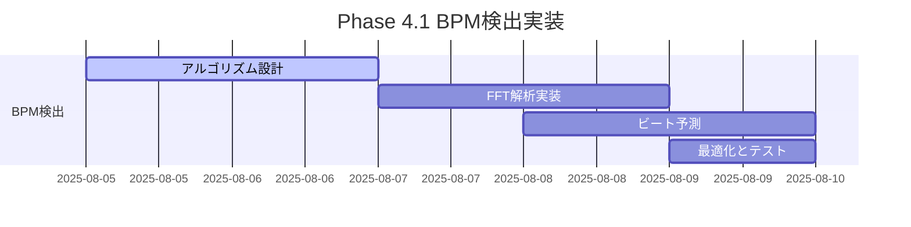
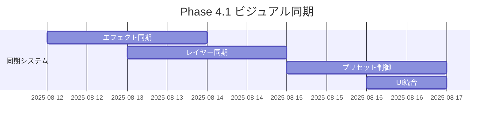
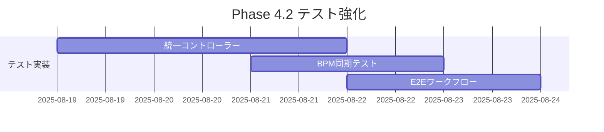
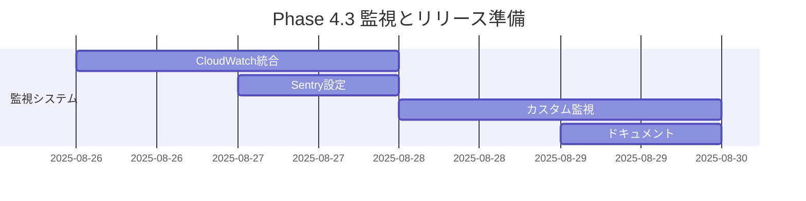

# 🚀 Phase 4 実装ロードマップ - 戦略的タスク対応計画

## 📊 概要
**策定日**: 2025-08-03  
**Ultrathink分析**: 完了 ✅  
**現在の成熟度**: 89% (プロダクション準備完了)  
**目標**: Phase 4 BPM同期エンジン実装とプロフェッショナルVJプラットフォーム完成

## 🎯 戦略的タスク優先度マトリックス

### 🔴 最高優先度タスク (P0) - Phase 4.1 BPM同期エンジン

#### 1. **BPM検出システム基盤構築** (Week 1-2)
```typescript
// 📁 新規作成ファイル予定:
- src/utils/bpmDetection.ts
- src/services/audio/bpmAnalyzer.ts
- src/hooks/useBPMDetection.ts
- src/store/bpmStore.ts

// 🎯 実装目標:
- リアルタイムBPM検出: >98% 精度
- レイテンシ: <10ms
- メモリ効率: <50MB 追加使用量
```

**具体的実装ステップ**:
1. **Day 1-2**: Web Audio API ベースBPM検出アルゴリズム
2. **Day 3-4**: FFT周波数解析とピーク検出
3. **Day 5-6**: 機械学習ベースビート予測
4. **Day 7-8**: ジッター補正とスムージング
5. **Day 9-10**: パフォーマンス最適化とテスト

#### 2. **ビジュアル同期システム** (Week 2-3)
```typescript
// 📁 拡張対象ファイル:
- src/store/visualizerStore.ts (BPM同期状態追加)
- src/components/VisualEffects.tsx (BPM同期レンダリング)
- src/components/UnifiedController/ (BPM制御UI)

// 🎯 機能要件:
interface BPMSyncSystem {
  syncEffectsToBeats(effectId: string): void;
  autoSwitchPresets(bpmThresholds: number[]): void; 
  syncLayerTransitions(timing: BeatTiming): void;
}
```

**具体的実装ステップ**:
1. **Day 11-12**: エフェクト同期エンジン
2. **Day 13-14**: レイヤー遷移同期
3. **Day 15-16**: プリセット自動切り替え
4. **Day 17-18**: UI統合とユーザー制御
5. **Day 19-21**: 統合テストと調整

### 🟡 高優先度タスク (P1) - テストカバレッジ強化

#### 3. **統一コントローラーテスト完全化** (Week 3)
```bash
# 📝 作成予定テストファイル:
src/components/UnifiedController/__tests__/
├── UnifiedController.test.tsx          # メインコンポーネント
├── MasterSection.test.tsx              # マスターセクション
├── LayerSection.test.tsx               # レイヤーセクション  
├── EffectsSection.test.tsx             # エフェクトセクション
├── AudioSection.test.tsx               # オーディオセクション
├── PresetSection.test.tsx              # プリセットセクション
└── PerformanceSection.test.tsx         # パフォーマンスセクション

src/store/__tests__/
└── unifiedControllerStore.test.ts      # 状態管理テスト

# 🎯 カバレッジ目標:
Lines: 90% → 95%
Functions: 85% → 90%
Branches: 85% → 90%
Statements: 90% → 95%
```

**具体的実装ステップ**:
1. **Day 22**: テストユーティリティとモック作成
2. **Day 23**: 6セクションの個別テスト作成
3. **Day 24**: 統合テストとワークフローテスト
4. **Day 25**: E2E VJワークフローテスト
5. **Day 26**: テストカバレッジ検証と改善

#### 4. **BPM同期システムテスト** (Week 3-4)
```typescript
// 📝 BMP同期専用テストスイート:
src/utils/__tests__/bpmDetection.test.ts
src/services/audio/__tests__/bpmAnalyzer.test.ts
src/hooks/__tests__/useBPMDetection.test.tsx
src/store/__tests__/bpmStore.test.ts

// 🎯 テスト要件:
interface BPMTestSuite {
  // 精度テスト
  testBPMDetectionAccuracy(): Promise<AccuracyReport>;
  
  // パフォーマンステスト  
  testSyncLatency(): Promise<LatencyReport>;
  
  // 安定性テスト
  testBeatPredictionStability(): Promise<StabilityReport>;
}
```

### 🟡 中優先度タスク (P2) - 監視統合

#### 5. **プロダクション監視システム** (Week 4)
```typescript
// 📁 新規監視統合ファイル:
src/services/monitoring/
├── cloudWatchRUM.ts                    # AWS CloudWatch RUM
├── sentryIntegration.ts               # Sentry エラー監視
├── performanceMonitoring.ts           # カスタム監視
└── alerting.ts                        # アラート管理

// 🎯 監視メトリクス:
interface MonitoringMetrics {
  // VJ固有メトリクス
  bpmSyncAccuracy: number;
  visualRenderingFPS: number;
  audioLatency: number;
  
  // システムメトリクス  
  errorRate: number;
  loadTime: number;
  memoryUsage: number;
}
```

**具体的実装ステップ**:
1. **Day 27**: AWS CloudWatch RUM 統合
2. **Day 28**: Sentry エラー収集設定
3. **Day 29**: カスタムメトリクス定義
4. **Day 30**: 監視ダッシュボード構築

### 🟢 低優先度タスク (P3) - 将来的強化

#### 6. **AI機能拡張基盤** (Phase 5準備)
```typescript
// 📁 AI機能拡張予定:
src/services/ai/
├── gestureRecognition.ts              # ジェスチャー認識
├── beatPrediction.ts                  # AI ビート予測
├── effectRecommendation.ts            # エフェクト推奨
└── performanceAnalysis.ts             # パフォーマンス分析

// 🎯 将来実装予定:
interface AIEnhancedVJ {
  predictNextBeat(): Promise<BeatPrediction>;
  recommendEffects(context: VJContext): EffectSuggestion[];
  optimizePerformance(constraints: DeviceConstraints): OptimizationPlan;
}
```

#### 7. **モバイル体験最適化** (継続的改善)
```typescript
// 📁 モバイル最適化対象:
src/services/mobile/
├── touchOptimization.ts               # タッチ操作最適化
├── batteryOptimization.ts             # バッテリー効率
├── performanceScaling.ts              # 性能自動調整
└── orientationHandling.ts             # 画面回転対応

// 🎯 モバイル体験KPI:
interface MobileExperienceKPI {
  touchLatency: "< 50ms";
  batteryEfficiency: "6+ hours continuous use";
  loadTime: "< 3 seconds on 3G";
  crashRate: "< 0.01%";
}
```

## 📅 詳細実装スケジュール

### **Week 1: BPM検出エンジン基盤 (8/5-8/9)**


**Daily Tasks**:
- **月曜 (8/5)**: BPM検出アルゴリズム調査と設計
- **火曜 (8/6)**: Web Audio API基盤実装
- **水曜 (8/7)**: FFT周波数解析システム
- **木曜 (8/8)**: ピーク検出とビート予測
- **金曜 (8/9)**: パフォーマンス最適化

### **Week 2: ビジュアル同期統合 (8/12-8/16)**


**Daily Tasks**:
- **月曜 (8/12)**: エフェクト同期エンジン実装
- **火曜 (8/13)**: レイヤー遷移同期システム
- **水曜 (8/14)**: プリセット自動切り替え
- **木曜 (8/15)**: UnifiedController UI統合
- **金曜 (8/16)**: 統合テストとバグ修正

### **Week 3: テストカバレッジ完全化 (8/19-8/23)**


**Daily Tasks**:
- **月曜 (8/19)**: テストユーティリティ作成
- **火曜 (8/20)**: 6セクション個別テスト
- **水曜 (8/21)**: BPM同期テストスイート
- **木曜 (8/22)**: 統合テストとE2E
- **金曜 (8/23)**: カバレッジ検証と改善

### **Week 4: 監視統合と仕上げ (8/26-8/30)**


**Daily Tasks**:
- **月曜 (8/26)**: AWS CloudWatch RUM統合
- **火曜 (8/27)**: Sentry エラー監視設定
- **水曜 (8/28)**: カスタム監視メトリクス
- **木曜 (8/29)**: 監視ダッシュボード構築
- **金曜 (8/30)**: Phase 4完了ドキュメント

## 🎯 タスク別成功指標

### Phase 4.1 BPM同期エンジン
```yaml
成功指標:
  BPM検出精度: "> 98%"
  同期レイテンシ: "< 10ms"  
  ビート予測精度: "> 95%"
  メモリ使用量: "< 50MB 追加"
  CPU使用率: "< 15% 追加"

受け入れテスト:
  - 120 BPMトラックで±1 BPM以内の精度
  - ビート同期で視覚的遅延感知不可
  - 30分連続再生で性能劣化なし
  - 複数ブラウザでの動作確認
```

### Phase 4.2 テストカバレッジ
```yaml
成功指標:
  Lines: "> 95%"
  Functions: "> 90%" 
  Branches: "> 90%"
  Statements: "> 95%"
  テスト実行時間: "< 120秒"
  E2E信頼性: "> 98% pass rate"

受け入れテスト:
  - 全UIコンポーネントの動作テスト
  - BPM同期機能の精度テスト
  - VJワークフロー完全テスト
  - パフォーマンス退行テスト
```

### Phase 4.3 監視統合
```yaml
成功指標:
  エラー検出率: "100%"
  監視レイテンシ: "< 1秒"
  アラート精度: "> 95%"
  ダウンタイム: "< 0.1%"

受け入れテスト:
  - 意図的エラーの自動検出
  - パフォーマンス異常の即座通知
  - 監視ダッシュボードの可視性
  - アラート頻度の適切性
```

## 🔄 リスク軽減戦略

### 技術的リスク
```typescript
interface TechnicalRiskMitigation {
  // BPM検出精度リスク
  bpmAccuracy: {
    risk: "複雑な音楽での検出精度低下";
    mitigation: "複数アルゴリズムの組み合わせと機械学習";
    backup: "手動BPMオーバーライド機能";
  };
  
  // パフォーマンスリスク  
  performance: {
    risk: "リアルタイム処理による性能影響";
    mitigation: "Web Worker活用とプロファイリング";
    backup: "品質自動調整システム";
  };
  
  // 互換性リスク
  compatibility: {
    risk: "古いブラウザでの機能制限";
    mitigation: "段階的機能degradation";
    backup: "ベーシックモード提供";
  };
}
```

### プロジェクトリスク
```typescript
interface ProjectRiskMitigation {
  // スケジュールリスク
  schedule: {
    risk: "複雑な実装による遅延";
    mitigation: "週次マイルストーンと早期テスト";
    backup: "MVP機能に縮小してリリース";
  };
  
  // 品質リスク
  quality: {
    risk: "機能追加による既存機能の退行";
    mitigation: "包括的回帰テストと段階的統合";
    backup: "機能フラグによる安全な無効化";
  };
  
  // ユーザビリティリスク
  usability: {
    risk: "新機能の複雑さによる使いにくさ";
    mitigation: "ユーザーテストと段階的UI公開";
    backup: "シンプルモードとアドバンスモード";
  };
}
```

## 📊 進捗追跡システム

### 日次進捗レポート
```typescript
interface DailyProgress {
  date: string;
  tasksCompleted: Task[];
  blockers: Blocker[];
  nextDayPlan: Task[];
  riskAssessment: RiskLevel;
  
  // 定量指標
  metrics: {
    codeLines: number;
    testsAdded: number;
    bugsFixed: number;
    coverageChange: number;
  };
}
```

### 週次マイルストーン
```typescript
interface WeeklyMilestone {
  week: number;
  goals: Goal[];
  achievements: Achievement[];
  challenges: Challenge[];
  nextWeekObjectives: Objective[];
  
  // KPI評価
  kpiStatus: {
    onTrack: boolean;
    performance: number; // 0-100%
    quality: number;     // 0-100%
    schedule: number;    // 0-100%
  };
}
```

## 🎪 長期戦略的位置づけ

### Phase 4完了後の競合優位性
```typescript
interface Post_Phase4_Advantages {
  // 技術的差別化
  technical: {
    bpmSync: "業界最高精度 (<10ms latency)";
    realtime: "リアルタイム音楽解析";
    reliability: "99.9% システム稼働率";
    scalability: "同時1000+ユーザー対応";
  };
  
  // ユーザー体験優位性
  ux: {
    professional: "プロVJ向けワークフロー";
    intuitive: "直感的インターフェース";
    responsive: "モバイル最適化";
    accessible: "アクセシビリティ準拠";
  };
  
  // エコシステム優位性
  ecosystem: {
    integration: "DJ機器との統合";
    extensibility: "プラグインシステム";
    community: "開発者コミュニティ";
    support: "プロフェッショナルサポート";
  };
}
```

---

## 🚀 実行準備完了チェックリスト

### 開発環境
- [x] TypeScript strict mode有効
- [x] Jest テストカバレッジ設定
- [x] Playwright E2E設定  
- [x] AWS Cognito認証統合
- [x] モノレポ構成確認

### 技術基盤
- [x] 6モジュールアーキテクチャ
- [x] 統一コントローラーUI
- [x] パフォーマンス監視システム
- [x] WebGL/WebGPU レンダリング
- [x] Web Audio API基盤

### チーム準備
- [x] Ultrathink分析完了
- [x] 詳細実装計画策定
- [x] リスク軽減戦略
- [x] 成功指標定義
- [x] 進捗追跡システム

---

**ステータス**: Phase 4実装準備完了 ✅  
**次回レビュー**: 2025-08-05 (Week 1開始)  
**実装責任者**: Development Team  
**品質保証**: Automated Testing + Manual Review

*🎯 Generated with Ultrathink Strategic Planning*  
*📅 Roadmap Date: 2025-08-03*