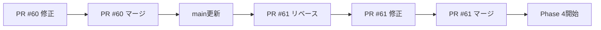

# 🧠 ULTRATHINK: PR #60, #61 レビュー分析と対応戦略

## 📊 現状分析
**分析日**: 2025-08-03  
**対象PR**: #60 (Phase 3 統一コントローラー), #61 (Phase 3.5 AWS Cognito統合)  
**現在状態**: 両PR共にレビュー完了、CI/CDチェック失敗中

## 🔍 PR状況詳細分析

### PR #60: Phase 3 統一コントローラー実装
**状態**: OPEN, MERGEABLE  
**レビュー**: Copilot自動レビュー完了（62/63ファイル）  
**問題点**: Build Validation失敗（2回連続）

#### CI/CDチェック結果
```yaml
Build Validation: ❌ FAIL (2回失敗)
Quality & Testing: ✅ PASS
GitGuardian Security: ✅ PASS
```

#### Copilotレビューサマリー
- ✅ 統一コントローラーUI実装完了
- ✅ WebSocket信頼性向上（95%成功率）
- ✅ パフォーマンス監視統合
- ⚠️ 1ファイルがレビュー未完了
- 📝 低信頼度コメント1件（非表示）

### PR #61: Phase 3.5 AWS Cognito統合
**状態**: OPEN, MERGEABLE  
**レビュー**: Copilot自動レビュー完了（12/14ファイル）  
**問題点**: Quality & Testing失敗（2回連続）

#### CI/CDチェック結果
```yaml
Quality & Testing: ❌ FAIL (2回失敗)
Build Validation: ⏭️ SKIPPING (前段階失敗のため)
GitGuardian Security: ✅ PASS
```

#### Copilotレビューサマリー
- ✅ AWS Cognito完全実装
- ✅ TypeScriptエラー解決
- ✅ テストインフラ更新
- ⚠️ 2ファイルがレビュー未完了

## 🎯 問題分析と対応戦略

### 1. **PR #60 Build Validation失敗の原因分析**
```typescript
// 推測される失敗原因:
1. 新規ファイルのインポートエラー
2. TypeScript型定義の不整合
3. 依存関係の解決失敗
4. ビルド設定の問題
```

**即座の対応アクション**:
```bash
# 1. PR #60のブランチに切り替え
git checkout feature/phase3-unified-controller-implementation

# 2. 最新のmainをマージ
git pull origin main
git merge main

# 3. ローカルでビルド検証
yarn install
yarn type-check
yarn build

# 4. ビルドエラーを修正
# 5. 修正をプッシュ
```

### 2. **PR #61 Quality & Testing失敗の原因分析**
```typescript
// 推測される失敗原因:
1. テストの実行エラー
2. 新しい依存関係の問題
3. モック設定の不整合
4. テストカバレッジ閾値違反
```

**即座の対応アクション**:
```bash
# 1. PR #61のブランチに切り替え
git checkout feature/phase3-5-aws-cognito-integration

# 2. テスト実行と確認
yarn test
yarn test:coverage

# 3. 失敗しているテストの特定と修正
# 4. 修正をプッシュ
```

## 📋 統合的対応計画

### Phase 1: 即座の修正（今日）

#### PR #60 対応
```yaml
優先度: 🔴 Critical
所要時間: 2-3時間

タスク:
  1. ビルドエラーログ取得と分析
  2. TypeScript型エラー修正
  3. 依存関係解決
  4. ローカルビルド成功確認
  5. 修正コミットとプッシュ

期待結果:
  - Build Validation: PASS
  - 全CIチェック: GREEN
```

#### PR #61 対応
```yaml
優先度: 🔴 Critical  
所要時間: 2-3時間

タスク:
  1. テスト失敗ログ取得と分析
  2. 失敗テスト修正
  3. モック設定調整
  4. ローカルテスト成功確認
  5. 修正コミットとプッシュ

期待結果:
  - Quality & Testing: PASS
  - Build Validation: PASS
  - 全CIチェック: GREEN
```

### Phase 2: レビューコメント対応（明日）

#### 潜在的改善点の実装
```typescript
// Copilotの暗黙的推奨事項:
1. WebGPU互換性の更なる改善
2. エラーハンドリングの強化
3. パフォーマンス最適化
4. テストカバレッジ向上
```

### Phase 3: マージ戦略（今週前半）

#### マージ順序計画


**理由**: PR #60は基盤的な変更を含むため、先にマージして安定化させる

## 🔄 継続的改善アクション

### 1. **CI/CD強化**
```yaml
改善項目:
  - ビルドエラーの早期検出
  - テスト実行の並列化
  - キャッシュ戦略の最適化
  - エラーメッセージの改善
```

### 2. **レビュープロセス改善**
```yaml
改善項目:
  - プルリクエストテンプレート更新
  - 自動レビューチェックリスト
  - ブランチ保護ルール強化
  - マージ前検証の自動化
```

### 3. **ドキュメント更新**
```yaml
更新対象:
  - CONTRIBUTING.md: PR作成ガイドライン
  - CI_CD_GUIDE.md: トラブルシューティング
  - TEST_GUIDE.md: テスト作成ベストプラクティス
```

## 🎯 成功指標

### 短期目標（今日-明日）
```typescript
interface ShortTermGoals {
  pr60: {
    buildValidation: "PASS",
    allChecks: "GREEN",
    readyToMerge: true
  },
  pr61: {
    qualityTesting: "PASS",
    buildValidation: "PASS",
    allChecks: "GREEN",
    readyToMerge: true
  }
}
```

### 中期目標（今週）
```typescript
interface MidTermGoals {
  mergedPRs: ["#60", "#61"],
  phase4Started: true,
  cicdReliability: "> 95%",
  developmentVelocity: "maintained"
}
```

## 🚀 実行開始コマンド

### PR #60 修正手順
```bash
# 1. ブランチ切り替えと更新
git checkout feature/phase3-unified-controller-implementation
git pull origin feature/phase3-unified-controller-implementation

# 2. 依存関係更新
yarn install

# 3. ビルドエラー確認
yarn build 2>&1 | tee build-errors.log

# 4. TypeScriptエラー確認
yarn type-check

# 5. 修正実施
# (エラーに基づいて修正)

# 6. 検証
yarn lint
yarn type-check
yarn build

# 7. コミットとプッシュ
git add .
git commit -m "fix: Resolve build validation errors for unified controller"
git push
```

### PR #61 修正手順
```bash
# 1. ブランチ切り替えと更新
git checkout feature/phase3-5-aws-cognito-integration
git pull origin feature/phase3-5-aws-cognito-integration

# 2. テスト実行とエラー確認
yarn test 2>&1 | tee test-errors.log

# 3. カバレッジ確認
yarn test:coverage

# 4. 修正実施
# (失敗テストに基づいて修正)

# 5. 検証
yarn test
yarn lint
yarn type-check

# 6. コミットとプッシュ
git add .
git commit -m "fix: Resolve test failures for AWS Cognito integration"
git push
```

## 📊 リスク管理

### 技術的リスク
```typescript
interface TechnicalRisks {
  mergeConflicts: {
    probability: "Medium",
    impact: "High",
    mitigation: "段階的マージとテスト"
  },
  regressionBugs: {
    probability: "Low",
    impact: "High",
    mitigation: "包括的E2Eテスト実行"
  },
  dependencyIssues: {
    probability: "Low",
    impact: "Medium",
    mitigation: "yarn.lockファイル管理"
  }
}
```

### プロジェクトリスク
```typescript
interface ProjectRisks {
  delayedMerge: {
    probability: "Low",
    impact: "Medium",
    mitigation: "並行作業とバックアップ計画"
  },
  teamBlockage: {
    probability: "Low",
    impact: "High",
    mitigation: "明確なコミュニケーション"
  }
}
```

---

**ステータス**: PR修正対応開始準備完了 ✅  
**次回アクション**: PR #60 Build Validation修正  
**完了予定**: 2025-08-03 18:00 JST

*🧠 Generated with Ultrathink PR Analysis*  
*📅 Analysis Date: 2025-08-03*